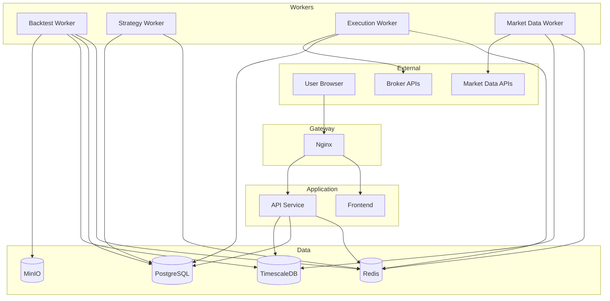

# ApexTrade - System Architecture

**Version:** 1.0  
**Date:** February 1, 2026  
**Status:** Draft  
**Author:** ApexTrade Team

---

## Table of Contents

1. [Architecture Overview](#1-architecture-overview)
2. [Container Architecture](#2-container-architecture)
3. [Service Architecture](#3-service-architecture)
4. [Data Flow Architecture](#4-data-flow-architecture)
5. [Event-Driven Patterns](#5-event-driven-patterns)
6. [Deployment Topology](#6-deployment-topology)
7. [Scaling Strategy](#7-scaling-strategy)
8. [Disaster Recovery](#8-disaster-recovery)

---

## 1. Architecture Overview

### 1.1 High-Level Architecture

```
┌─────────────────────────────────────────────────────────────────────────────────────┐
│                                    APEXTRADE                                         │
├─────────────────────────────────────────────────────────────────────────────────────┤
│                                                                                      │
│   ┌─────────────────────────────────────────────────────────────────────────────┐   │
│   │                            CLIENT LAYER                                      │   │
│   │                                                                              │   │
│   │   ┌─────────────┐   ┌─────────────┐   ┌─────────────┐   ┌─────────────┐    │   │
│   │   │   Browser   │   │  Mobile PWA │   │   API CLI   │   │  Webhook    │    │   │
│   │   │   (Next.js) │   │             │   │   Client    │   │  Consumers  │    │   │
│   │   └──────┬──────┘   └──────┬──────┘   └──────┬──────┘   └──────┬──────┘    │   │
│   │          │                 │                 │                 │            │   │
│   └──────────┼─────────────────┼─────────────────┼─────────────────┼────────────┘   │
│              │                 │                 │                 │                 │
│              ▼                 ▼                 ▼                 ▼                 │
│   ┌─────────────────────────────────────────────────────────────────────────────┐   │
│   │                            GATEWAY LAYER                                     │   │
│   │                                                                              │   │
│   │   ┌─────────────────────────────────────────────────────────────────────┐   │   │
│   │   │                         NGINX                                        │   │   │
│   │   │   • SSL Termination     • Load Balancing    • Rate Limiting         │   │   │
│   │   │   • Static File Serving • Gzip Compression  • Security Headers      │   │   │
│   │   └─────────────────────────────────────────────────────────────────────┘   │   │
│   │                                    │                                         │   │
│   └────────────────────────────────────┼─────────────────────────────────────────┘   │
│                                        │                                             │
│              ┌─────────────────────────┼─────────────────────────┐                  │
│              ▼                         ▼                         ▼                  │
│   ┌─────────────────────┐   ┌─────────────────────┐   ┌─────────────────────┐      │
│   │    FRONTEND         │   │     API SERVICE     │   │   WEBSOCKET         │      │
│   │    Next.js SSR      │   │     FastAPI         │   │   SERVICE           │      │
│   │    :3000            │   │     :8000           │   │   :8001             │      │
│   └─────────────────────┘   └──────────┬──────────┘   └──────────┬──────────┘      │
│                                        │                         │                  │
│   ┌────────────────────────────────────┼─────────────────────────┼──────────────┐   │
│   │                        SERVICE LAYER                         │              │   │
│   │                                    │                         │              │   │
│   │   ┌────────────┐  ┌────────────┐  │  ┌────────────┐  ┌────────────┐       │   │
│   │   │   Rule     │  │  Strategy  │◀─┴──│  Backtest  │  │ Execution  │       │   │
│   │   │   Engine   │  │  Manager   │     │  Engine    │  │  Manager   │       │   │
│   │   └────────────┘  └────────────┘     └────────────┘  └────────────┘       │   │
│   │                                                                            │   │
│   │   ┌────────────┐  ┌────────────┐     ┌────────────┐  ┌────────────┐       │   │
│   │   │  Market    │  │ Portfolio  │     │   User     │  │   Alert    │       │   │
│   │   │   Data     │  │  Manager   │     │  Service   │  │  Service   │       │   │
│   │   └────────────┘  └────────────┘     └────────────┘  └────────────┘       │   │
│   │                                                                            │   │
│   └────────────────────────────────────────────────────────────────────────────┘   │
│                                        │                                             │
│   ┌────────────────────────────────────┼────────────────────────────────────────┐   │
│   │                        MESSAGE LAYER                                         │   │
│   │                                    ▼                                         │   │
│   │   ┌─────────────────────────────────────────────────────────────────────┐   │   │
│   │   │                          REDIS                                       │   │   │
│   │   │   • Celery Broker       • PubSub           • Session Cache          │   │   │
│   │   │   • Result Backend      • Real-time Data   • Rate Limiting          │   │   │
│   │   └─────────────────────────────────────────────────────────────────────┘   │   │
│   │                                    │                                         │   │
│   └────────────────────────────────────┼─────────────────────────────────────────┘   │
│                                        │                                             │
│   ┌────────────────────────────────────┼────────────────────────────────────────┐   │
│   │                        WORKER LAYER                                          │   │
│   │                                    ▼                                         │   │
│   │   ┌────────────┐  ┌────────────┐  ┌────────────┐  ┌────────────┐            │   │
│   │   │  Backtest  │  │  Strategy  │  │ Execution  │  │ Market     │            │   │
│   │   │  Worker    │  │  Worker    │  │  Worker    │  │ Data       │            │   │
│   │   │  (×4)      │  │  (×2)      │  │  (×1)      │  │ Worker     │            │   │
│   │   └────────────┘  └────────────┘  └────────────┘  └────────────┘            │   │
│   │                                                                              │   │
│   └──────────────────────────────────────────────────────────────────────────────┘   │
│                                        │                                             │
│   ┌────────────────────────────────────┼────────────────────────────────────────┐   │
│   │                        DATA LAYER                                            │   │
│   │                                    ▼                                         │   │
│   │   ┌────────────────┐  ┌────────────────┐  ┌────────────────┐                │   │
│   │   │   PostgreSQL   │  │   TimescaleDB  │  │     MinIO      │                │   │
│   │   │   :5432        │  │   :5433        │  │     :9000      │                │   │
│   │   │                │  │                │  │                │                │   │
│   │   │  • Users       │  │  • OHLCV       │  │  • Backtest    │                │   │
│   │   │  • Strategies  │  │  • Ticks       │  │    Reports     │                │   │
│   │   │  • Portfolios  │  │  • Equity      │  │  • Exports     │                │   │
│   │   │  • Trades      │  │    History     │  │  • Logs        │                │   │
│   │   │  • Backtests   │  │                │  │                │                │   │
│   │   └────────────────┘  └────────────────┘  └────────────────┘                │   │
│   │                                                                              │   │
│   └──────────────────────────────────────────────────────────────────────────────┘   │
│                                                                                      │
│   ┌──────────────────────────────────────────────────────────────────────────────┐   │
│   │                        MONITORING LAYER                                       │   │
│   │                                                                               │   │
│   │   ┌────────────────┐  ┌────────────────┐  ┌────────────────┐                 │   │
│   │   │   Prometheus   │  │    Grafana     │  │     Loki       │                 │   │
│   │   │   :9090        │  │    :3001       │  │     :3100      │                 │   │
│   │   └────────────────┘  └────────────────┘  └────────────────┘                 │   │
│   │                                                                               │   │
│   └──────────────────────────────────────────────────────────────────────────────┘   │
│                                                                                      │
└──────────────────────────────────────────────────────────────────────────────────────┘
```

### 1.2 Architecture Principles

| Principle | Description | Implementation |
|-----------|-------------|----------------|
| **Modularity** | Services have single responsibility | Separate containers per service |
| **Event-Driven** | Async communication between services | Redis pub/sub + Celery queues |
| **Stateless** | API servers don't hold session state | JWT tokens, Redis for sessions |
| **Immutability** | Container images are immutable | Versioned Docker images |
| **Observability** | Full visibility into system behavior | Prometheus + Grafana + Loki |
| **Resilience** | Graceful failure handling | Retry policies, circuit breakers |

---

## 2. Container Architecture

### 2.1 Docker Compose Topology

```yaml
# docker-compose.yml structure
version: '3.9'

services:
  # ─────────────────────────────────────────────────────────────
  # GATEWAY LAYER
  # ─────────────────────────────────────────────────────────────
  nginx:
    image: nginx:1.25-alpine
    ports:
      - "80:80"
      - "443:443"
    depends_on:
      - frontend
      - api
    networks:
      - frontend-network

  # ─────────────────────────────────────────────────────────────
  # APPLICATION LAYER
  # ─────────────────────────────────────────────────────────────
  frontend:
    build: ./frontend
    expose:
      - "3000"
    environment:
      - NEXT_PUBLIC_API_URL=http://api:8000
    depends_on:
      - api
    networks:
      - frontend-network

  api:
    build: ./backend
    expose:
      - "8000"
    environment:
      - DATABASE_URL=${DATABASE_URL}
      - REDIS_URL=${REDIS_URL}
    depends_on:
      - postgres
      - timescaledb
      - redis
    networks:
      - frontend-network
      - backend-network

  # ─────────────────────────────────────────────────────────────
  # WORKER LAYER
  # ─────────────────────────────────────────────────────────────
  worker-backtest:
    build: ./backend
    command: celery -A app.celery worker -Q backtest_queue -c 4
    deploy:
      replicas: 2
    depends_on:
      - redis
      - postgres
    networks:
      - backend-network

  worker-strategy:
    build: ./backend
    command: celery -A app.celery worker -Q strategy_queue -c 2
    depends_on:
      - redis
      - postgres
    networks:
      - backend-network

  worker-execution:
    build: ./backend
    command: celery -A app.celery worker -Q execution_queue -c 1
    depends_on:
      - redis
      - postgres
    networks:
      - backend-network

  worker-market-data:
    build: ./backend
    command: celery -A app.celery worker -Q market_data_queue -c 2
    depends_on:
      - redis
      - timescaledb
    networks:
      - backend-network

  celery-beat:
    build: ./backend
    command: celery -A app.celery beat --loglevel=info
    depends_on:
      - redis
    networks:
      - backend-network

  # ─────────────────────────────────────────────────────────────
  # DATA LAYER
  # ─────────────────────────────────────────────────────────────
  postgres:
    image: postgres:16-alpine
    volumes:
      - postgres_data:/var/lib/postgresql/data
    environment:
      - POSTGRES_DB=apextrade
      - POSTGRES_USER=${POSTGRES_USER}
      - POSTGRES_PASSWORD=${POSTGRES_PASSWORD}
    networks:
      - backend-network

  timescaledb:
    image: timescale/timescaledb:latest-pg16
    volumes:
      - timescale_data:/var/lib/postgresql/data
    environment:
      - POSTGRES_DB=apextrade_ts
      - POSTGRES_USER=${POSTGRES_USER}
      - POSTGRES_PASSWORD=${POSTGRES_PASSWORD}
    networks:
      - backend-network

  redis:
    image: redis:7-alpine
    volumes:
      - redis_data:/data
    command: redis-server --appendonly yes
    networks:
      - backend-network

  minio:
    image: minio/minio:latest
    volumes:
      - minio_data:/data
    command: server /data --console-address ":9001"
    environment:
      - MINIO_ROOT_USER=${MINIO_USER}
      - MINIO_ROOT_PASSWORD=${MINIO_PASSWORD}
    networks:
      - backend-network

  # ─────────────────────────────────────────────────────────────
  # MONITORING LAYER
  # ─────────────────────────────────────────────────────────────
  prometheus:
    image: prom/prometheus:v2.48.0
    volumes:
      - ./monitoring/prometheus.yml:/etc/prometheus/prometheus.yml
      - prometheus_data:/prometheus
    networks:
      - backend-network

  grafana:
    image: grafana/grafana-oss:10.2.0
    volumes:
      - grafana_data:/var/lib/grafana
    environment:
      - GF_SECURITY_ADMIN_PASSWORD=${GRAFANA_PASSWORD}
    networks:
      - backend-network

  loki:
    image: grafana/loki:2.9.0
    volumes:
      - loki_data:/loki
    networks:
      - backend-network

networks:
  frontend-network:
    driver: bridge
  backend-network:
    driver: bridge

volumes:
  postgres_data:
  timescale_data:
  redis_data:
  minio_data:
  prometheus_data:
  grafana_data:
  loki_data:
```

### 2.2 Container Resource Limits

| Container | CPU Limit | Memory Limit | Replicas |
|-----------|-----------|--------------|----------|
| nginx | 0.5 | 128MB | 1 |
| frontend | 1.0 | 512MB | 2 |
| api | 2.0 | 1GB | 2 |
| worker-backtest | 2.0 | 2GB | 2-4 |
| worker-strategy | 1.0 | 512MB | 2 |
| worker-execution | 0.5 | 256MB | 1 |
| worker-market-data | 1.0 | 512MB | 2 |
| postgres | 2.0 | 2GB | 1 |
| timescaledb | 2.0 | 4GB | 1 |
| redis | 1.0 | 512MB | 1 |
| minio | 1.0 | 512MB | 1 |
| prometheus | 0.5 | 512MB | 1 |
| grafana | 0.5 | 256MB | 1 |
| loki | 0.5 | 512MB | 1 |

### 2.3 Network Isolation

```
┌─────────────────────────────────────────────────────────────────┐
│                      EXTERNAL NETWORK                            │
│                         (Internet)                               │
└───────────────────────────┬─────────────────────────────────────┘
                            │
                            │ :80, :443
                            ▼
┌─────────────────────────────────────────────────────────────────┐
│                     FRONTEND NETWORK                             │
│                                                                  │
│   ┌─────────┐      ┌─────────┐      ┌─────────┐                 │
│   │  nginx  │◀────▶│frontend │      │   api   │                 │
│   └─────────┘      └─────────┘      └────┬────┘                 │
│                                          │                       │
└──────────────────────────────────────────┼───────────────────────┘
                                           │
                            ┌──────────────┴──────────────┐
                            │                             │
                            ▼                             ▼
┌─────────────────────────────────────────────────────────────────┐
│                      BACKEND NETWORK                             │
│                                                                  │
│   ┌─────────┐  ┌─────────┐  ┌─────────┐  ┌─────────┐           │
│   │ worker  │  │ worker  │  │ worker  │  │ worker  │           │
│   │backtest │  │strategy │  │  exec   │  │  data   │           │
│   └────┬────┘  └────┬────┘  └────┬────┘  └────┬────┘           │
│        │            │            │            │                  │
│        └────────────┴─────┬──────┴────────────┘                 │
│                           ▼                                      │
│   ┌─────────┐       ┌─────────┐       ┌─────────┐               │
│   │ redis   │       │postgres │       │timescale│               │
│   └─────────┘       └─────────┘       └─────────┘               │
│                                                                  │
│   ┌─────────┐       ┌─────────┐       ┌─────────┐               │
│   │  minio  │       │promethe.│       │ grafana │               │
│   └─────────┘       └─────────┘       └─────────┘               │
│                                                                  │
└──────────────────────────────────────────────────────────────────┘
```

---

## 3. Service Architecture

### 3.1 Service Communication Matrix

| From \ To | API | Workers | Redis | PostgreSQL | TimescaleDB | External |
|-----------|-----|---------|-------|------------|-------------|----------|
| **Frontend** | REST/WS | - | - | - | - | - |
| **API** | - | Celery | ✓ | ✓ | ✓ | - |
| **Workers** | - | - | ✓ | ✓ | ✓ | Brokers |
| **Celery Beat** | - | Celery | ✓ | - | - | - |

### 3.2 Service Dependencies



### 3.3 Health Check Endpoints

| Service | Endpoint | Check Type |
|---------|----------|------------|
| API | `/health` | HTTP 200 |
| API | `/health/ready` | DB + Redis connection |
| Frontend | `/api/health` | SSR health |
| Workers | Celery inspect | Queue connection |
| PostgreSQL | `pg_isready` | TCP connection |
| Redis | `PING` | TCP connection |

```python
# api/health.py
from fastapi import APIRouter, HTTPException
from app.core.database import get_db_session
from app.core.redis import get_redis

router = APIRouter()

@router.get("/health")
async def health_check():
    return {"status": "healthy"}

@router.get("/health/ready")
async def readiness_check():
    # Check database
    try:
        async with get_db_session() as session:
            await session.execute("SELECT 1")
    except Exception as e:
        raise HTTPException(503, f"Database unhealthy: {e}")
    
    # Check Redis
    try:
        redis = await get_redis()
        await redis.ping()
    except Exception as e:
        raise HTTPException(503, f"Redis unhealthy: {e}")
    
    return {"status": "ready"}
```

---

## 4. Data Flow Architecture

### 4.1 Strategy Execution Flow

```
┌─────────────────────────────────────────────────────────────────────────────────────┐
│                         STRATEGY EXECUTION DATA FLOW                                 │
├─────────────────────────────────────────────────────────────────────────────────────┤
│                                                                                      │
│   ┌────────────────┐                                                                │
│   │ Market Data    │                                                                │
│   │ Worker         │                                                                │
│   └───────┬────────┘                                                                │
│           │                                                                          │
│           │ 1. Fetch new candles from exchange                                      │
│           ▼                                                                          │
│   ┌────────────────┐                                                                │
│   │ TimescaleDB    │                                                                │
│   │ (OHLCV)        │                                                                │
│   └───────┬────────┘                                                                │
│           │                                                                          │
│           │ 2. Publish "new_candle" event                                           │
│           ▼                                                                          │
│   ┌────────────────┐                                                                │
│   │ Redis PubSub   │◀──────────────────────────────────────┐                        │
│   │ "market:BTC"   │                                        │                        │
│   └───────┬────────┘                                        │                        │
│           │                                                  │                        │
│           │ 3. Strategy workers subscribe                   │                        │
│           ▼                                                  │                        │
│   ┌────────────────┐                                        │                        │
│   │ Strategy       │                                        │                        │
│   │ Worker         │                                        │                        │
│   └───────┬────────┘                                        │                        │
│           │                                                  │                        │
│           │ 4. Load active strategies for asset             │                        │
│           ▼                                                  │                        │
│   ┌────────────────┐                                        │                        │
│   │ PostgreSQL     │                                        │                        │
│   │ (Strategies)   │                                        │                        │
│   └───────┬────────┘                                        │                        │
│           │                                                  │                        │
│           │ 5. Evaluate rules against market data           │                        │
│           ▼                                                  │                        │
│   ┌────────────────┐                                        │                        │
│   │ Rule Engine    │                                        │                        │
│   │ (in-memory)    │                                        │                        │
│   └───────┬────────┘                                        │                        │
│           │                                                  │                        │
│           │ 6. Generate signal (BUY/SELL/HOLD)              │                        │
│           ▼                                                  │                        │
│   ┌────────────────┐         ┌────────────────┐             │                        │
│   │ Signal = BUY?  │─── NO ──│ Log & continue │─────────────┘                        │
│   └───────┬────────┘         └────────────────┘                                      │
│           │ YES                                                                      │
│           │ 7. Queue execution task                                                  │
│           ▼                                                                          │
│   ┌────────────────┐                                                                │
│   │ Redis Queue    │                                                                │
│   │ "execution"    │                                                                │
│   └───────┬────────┘                                                                │
│           │                                                                          │
│           │ 8. Execution worker picks up task                                       │
│           ▼                                                                          │
│   ┌────────────────┐                                                                │
│   │ Execution      │                                                                │
│   │ Worker         │                                                                │
│   └───────┬────────┘                                                                │
│           │                                                                          │
│           │ 9. Check risk limits                                                    │
│           ▼                                                                          │
│   ┌────────────────┐         ┌────────────────┐                                     │
│   │ Risk Check     │── FAIL ─│ Reject & Alert │                                     │
│   │ Passed?        │         └────────────────┘                                     │
│   └───────┬────────┘                                                                │
│           │ PASS                                                                     │
│           │ 10. Place order on broker                                               │
│           ▼                                                                          │
│   ┌────────────────┐                                                                │
│   │ Broker API     │                                                                │
│   │ (e.g. Binance) │                                                                │
│   └───────┬────────┘                                                                │
│           │                                                                          │
│           │ 11. Order confirmation received                                         │
│           ▼                                                                          │
│   ┌────────────────┐                                                                │
│   │ PostgreSQL     │                                                                │
│   │ (Trades)       │                                                                │
│   └───────┬────────┘                                                                │
│           │                                                                          │
│           │ 12. Update portfolio positions                                          │
│           ▼                                                                          │
│   ┌────────────────┐                                                                │
│   │ WebSocket      │                                                                │
│   │ Broadcast      │─────────▶ User Dashboard                                       │
│   └────────────────┘                                                                │
│                                                                                      │
└──────────────────────────────────────────────────────────────────────────────────────┘
```

### 4.2 Backtest Execution Flow

```
┌─────────────────────────────────────────────────────────────────────────────────────┐
│                           BACKTEST EXECUTION DATA FLOW                               │
├─────────────────────────────────────────────────────────────────────────────────────┤
│                                                                                      │
│   ┌────────────────┐                                                                │
│   │ User           │                                                                │
│   │ (Dashboard)    │                                                                │
│   └───────┬────────┘                                                                │
│           │                                                                          │
│           │ 1. POST /backtests with config                                          │
│           ▼                                                                          │
│   ┌────────────────┐                                                                │
│   │ API Service    │                                                                │
│   └───────┬────────┘                                                                │
│           │                                                                          │
│           │ 2. Validate config, create backtest record                              │
│           ▼                                                                          │
│   ┌────────────────┐                                                                │
│   │ PostgreSQL     │                                                                │
│   │ (Backtests)    │  status = "pending"                                            │
│   └───────┬────────┘                                                                │
│           │                                                                          │
│           │ 3. Queue backtest task                                                  │
│           ▼                                                                          │
│   ┌────────────────┐                                                                │
│   │ Redis Queue    │                                                                │
│   │ "backtest"     │                                                                │
│   └───────┬────────┘                                                                │
│           │                                                                          │
│           │ 4. Return backtest_id to user                                           │
│           └───────────────────────┐                                                  │
│                                   ▼                                                  │
│   ┌────────────────┐      ┌─────────────────┐                                       │
│   │ Backtest       │      │ User (polling   │                                       │
│   │ Worker         │      │ or WebSocket)   │                                       │
│   └───────┬────────┘      └─────────────────┘                                       │
│           │                        ▲                                                 │
│           │ 5. Load strategy config│                                                │
│           ▼                        │                                                 │
│   ┌────────────────┐               │                                                │
│   │ PostgreSQL     │               │                                                │
│   │ (Strategies)   │               │                                                │
│   └───────┬────────┘               │                                                │
│           │                        │                                                 │
│           │ 6. Load historical data│ Progress updates                               │
│           ▼                        │ via WebSocket                                  │
│   ┌────────────────┐               │                                                │
│   │ TimescaleDB    │               │                                                │
│   │ (OHLCV)        │               │                                                │
│   └───────┬────────┘               │                                                │
│           │                        │                                                 │
│           │ 7. Initialize backtest engine                                           │
│           ▼                        │                                                 │
│   ┌────────────────┐               │                                                │
│   │ Backtrader     │               │                                                │
│   │ Engine         │               │                                                │
│   └───────┬────────┘               │                                                │
│           │                        │                                                 │
│           │ 8. Iterate through candles                                              │
│           │    └─▶ Apply strategy rules                                             │
│           │    └─▶ Simulate trades                                                  │
│           │    └─▶ Track portfolio state                                            │
│           │    └─▶ Publish progress (10%)────────────────────┘                      │
│           ▼                                                                          │
│   ┌────────────────┐                                                                │
│   │ Backtest       │                                                                │
│   │ Complete       │                                                                │
│   └───────┬────────┘                                                                │
│           │                                                                          │
│           │ 9. Calculate metrics                                                    │
│           │    • Total Return                                                       │
│           │    • Sharpe Ratio                                                       │
│           │    • Max Drawdown                                                       │
│           │    • Win Rate                                                           │
│           ▼                                                                          │
│   ┌────────────────┐                                                                │
│   │ PostgreSQL     │  status = "completed"                                          │
│   │ (Backtests)    │  + results JSON                                                │
│   └───────┬────────┘                                                                │
│           │                                                                          │
│           │ 10. Store equity curve & trade log                                      │
│           ▼                                                                          │
│   ┌────────────────┐                                                                │
│   │ MinIO          │                                                                │
│   │ (Reports)      │                                                                │
│   └───────┬────────┘                                                                │
│           │                                                                          │
│           │ 11. Notify user completion                                              │
│           ▼                                                                          │
│   ┌────────────────┐                                                                │
│   │ WebSocket      │─────────▶ User Dashboard                                       │
│   │ "backtest:done"│                                                                │
│   └────────────────┘                                                                │
│                                                                                      │
└──────────────────────────────────────────────────────────────────────────────────────┘
```

### 4.3 Market Data Ingestion Flow

```
┌─────────────────────────────────────────────────────────────────────────────────────┐
│                         MARKET DATA INGESTION FLOW                                   │
├─────────────────────────────────────────────────────────────────────────────────────┤
│                                                                                      │
│   ┌──────────────────────────────────────────────────────────────────────────────┐  │
│   │                          SCHEDULED TASKS (Celery Beat)                        │  │
│   │                                                                               │  │
│   │   ┌────────────────┐  ┌────────────────┐  ┌────────────────┐                 │  │
│   │   │ Every 1 minute │  │ Every 1 hour   │  │ Every 1 day    │                 │  │
│   │   │ sync_1m_candles│  │ sync_1h_candles│  │ sync_1d_candles│                 │  │
│   │   └───────┬────────┘  └───────┬────────┘  └───────┬────────┘                 │  │
│   │           │                   │                   │                           │  │
│   └───────────┼───────────────────┼───────────────────┼───────────────────────────┘  │
│               │                   │                   │                              │
│               └─────────────────┬─┴───────────────────┘                             │
│                                 ▼                                                    │
│   ┌────────────────────────────────────────────────────────────────────────────────┐│
│   │                        Market Data Worker                                       ││
│   │                                                                                 ││
│   │   1. Get list of tracked symbols from config                                   ││
│   │   2. For each symbol:                                                          ││
│   │      a. Fetch latest candles from exchange via CCXT                            ││
│   │      b. Deduplicate against existing data                                      ││
│   │      c. Insert new candles into TimescaleDB                                    ││
│   │      d. Update Redis cache with latest price                                   ││
│   │      e. Publish "new_candle" event                                             ││
│   │                                                                                 ││
│   └───────────────────────────────┬─────────────────────────────────────────────────┘│
│                                   │                                                  │
│               ┌───────────────────┼───────────────────┐                             │
│               │                   │                   │                              │
│               ▼                   ▼                   ▼                              │
│   ┌────────────────┐  ┌────────────────┐  ┌────────────────┐                        │
│   │ TimescaleDB    │  │ Redis Cache    │  │ Redis PubSub   │                        │
│   │                │  │                │  │                │                        │
│   │ INSERT INTO    │  │ SET ticker:    │  │ PUBLISH        │                        │
│   │ ohlcv ...      │  │ BTC/USDT {...} │  │ market:BTC ... │                        │
│   └────────────────┘  └────────────────┘  └───────┬────────┘                        │
│                                                   │                                  │
│                                                   ▼                                  │
│                                   ┌────────────────────────────┐                    │
│                                   │ Strategy Workers           │                    │
│                                   │ (subscribed to market:*)   │                    │
│                                   └────────────────────────────┘                    │
│                                                                                      │
└──────────────────────────────────────────────────────────────────────────────────────┘
```

---

## 5. Event-Driven Patterns

### 5.1 Event Types

| Event | Channel | Payload | Publishers | Subscribers |
|-------|---------|---------|------------|-------------|
| `market.candle.new` | `market:{symbol}` | OHLCV data | Market Data Worker | Strategy Workers |
| `market.ticker.update` | `ticker:{symbol}` | Price data | Market Data Worker | API (WebSocket) |
| `strategy.signal` | `signals:{strategy_id}` | BUY/SELL signal | Strategy Worker | Execution Worker |
| `trade.executed` | `trades:{portfolio_id}` | Trade details | Execution Worker | API (WebSocket) |
| `backtest.progress` | `backtest:{id}` | Progress % | Backtest Worker | API (WebSocket) |
| `backtest.complete` | `backtest:{id}` | Results | Backtest Worker | API (WebSocket) |
| `alert.triggered` | `alerts:{user_id}` | Alert data | Alert Service | Notification Service |

### 5.2 Redis Pub/Sub Implementation

```python
# app/core/events.py
import redis.asyncio as redis
from typing import Callable, Dict, Any
import json

class EventBus:
    def __init__(self, redis_url: str):
        self.redis = redis.from_url(redis_url)
        self.pubsub = self.redis.pubsub()
        self._handlers: Dict[str, list[Callable]] = {}
    
    async def publish(self, channel: str, event: Dict[str, Any]):
        """Publish event to channel."""
        payload = json.dumps(event)
        await self.redis.publish(channel, payload)
    
    async def subscribe(self, pattern: str, handler: Callable):
        """Subscribe to channel pattern with handler."""
        if pattern not in self._handlers:
            self._handlers[pattern] = []
            await self.pubsub.psubscribe(pattern)
        self._handlers[pattern].append(handler)
    
    async def listen(self):
        """Listen for events and dispatch to handlers."""
        async for message in self.pubsub.listen():
            if message['type'] == 'pmessage':
                pattern = message['pattern'].decode()
                channel = message['channel'].decode()
                data = json.loads(message['data'])
                
                for handler in self._handlers.get(pattern, []):
                    await handler(channel, data)

# Usage in Strategy Worker
event_bus = EventBus(settings.REDIS_URL)

async def on_new_candle(channel: str, data: dict):
    symbol = channel.split(':')[1]
    # Evaluate strategies for this symbol
    await strategy_service.evaluate_all(symbol, data)

await event_bus.subscribe('market:*', on_new_candle)
await event_bus.listen()
```

### 5.3 Celery Task Queues

```python
# app/celery/config.py
from celery import Celery

celery_app = Celery('apextrade')

celery_app.conf.update(
    broker_url=settings.REDIS_URL,
    result_backend=settings.REDIS_URL,
    
    # Task routing
    task_routes={
        'app.tasks.backtest.*': {'queue': 'backtest_queue'},
        'app.tasks.strategy.*': {'queue': 'strategy_queue'},
        'app.tasks.execution.*': {'queue': 'execution_queue'},
        'app.tasks.market_data.*': {'queue': 'market_data_queue'},
    },
    
    # Concurrency per queue
    worker_concurrency=4,
    
    # Task serialization
    task_serializer='json',
    result_serializer='json',
    accept_content=['json'],
    
    # Task timeouts
    task_time_limit=600,  # 10 minutes hard limit
    task_soft_time_limit=540,  # 9 minutes soft limit
    
    # Retry policy
    task_default_retry_delay=60,
    task_max_retries=3,
)

# Scheduled tasks
celery_app.conf.beat_schedule = {
    'sync-1m-candles': {
        'task': 'app.tasks.market_data.sync_candles',
        'schedule': 60.0,  # Every minute
        'args': ('1m',),
    },
    'sync-1h-candles': {
        'task': 'app.tasks.market_data.sync_candles',
        'schedule': 3600.0,  # Every hour
        'args': ('1h',),
    },
    'sync-1d-candles': {
        'task': 'app.tasks.market_data.sync_candles',
        'schedule': 86400.0,  # Every day
        'args': ('1d',),
    },
    'portfolio-snapshot': {
        'task': 'app.tasks.portfolio.take_snapshot',
        'schedule': 300.0,  # Every 5 minutes
    },
}
```

---

## 6. Deployment Topology

### 6.1 Development Environment

```
Developer Machine
├── Docker Desktop
│   └── docker-compose up
│       ├── nginx:80
│       ├── frontend:3000 (hot reload)
│       ├── api:8000 (hot reload)
│       ├── worker-backtest
│       ├── worker-strategy
│       ├── worker-execution
│       ├── worker-market-data
│       ├── celery-beat
│       ├── postgres:5432
│       ├── timescaledb:5433
│       ├── redis:6379
│       ├── minio:9000
│       ├── prometheus:9090
│       └── grafana:3001
│
├── VS Code
│   ├── Frontend (Next.js)
│   └── Backend (Python)
│
└── Browser
    └── http://localhost
```

### 6.2 Production Environment (Single Server)

```
Production Server (8 CPU, 32GB RAM)
├── Docker Compose
│   ├── nginx (SSL termination via Let's Encrypt)
│   ├── frontend (2 replicas)
│   ├── api (2 replicas)
│   ├── worker-backtest (4 replicas)
│   ├── worker-strategy (2 replicas)
│   ├── worker-execution (1 replica)
│   ├── worker-market-data (2 replicas)
│   ├── celery-beat (1 replica)
│   ├── postgres (with daily backups)
│   ├── timescaledb (with compression)
│   ├── redis (with persistence)
│   ├── minio
│   ├── prometheus
│   ├── grafana
│   └── loki
│
├── Volumes (SSD)
│   ├── /data/postgres
│   ├── /data/timescale
│   ├── /data/redis
│   ├── /data/minio
│   └── /data/backups
│
└── Certbot (Let's Encrypt)
```

### 6.3 Production Environment (Kubernetes - Future)

```
Kubernetes Cluster
├── Ingress Controller (nginx-ingress)
│   └── TLS termination
│
├── Namespace: apextrade
│   ├── Deployment: frontend (2 pods, HPA)
│   ├── Deployment: api (3 pods, HPA)
│   ├── Deployment: worker-backtest (Deployment with KEDA scaling)
│   ├── Deployment: worker-strategy (2 pods)
│   ├── Deployment: worker-execution (1 pod)
│   ├── Deployment: worker-market-data (2 pods)
│   ├── CronJob: celery-beat
│   │
│   ├── StatefulSet: postgres (with PVC)
│   ├── StatefulSet: timescaledb (with PVC)
│   ├── StatefulSet: redis (with PVC)
│   │
│   ├── ConfigMap: app-config
│   ├── Secret: app-secrets
│   └── Secret: broker-credentials
│
└── Namespace: monitoring
    ├── Prometheus (with ServiceMonitor)
    ├── Grafana
    └── Loki
```

---

## 7. Scaling Strategy

### 7.1 Horizontal Scaling

| Component | Scaling Trigger | Scale Range | Notes |
|-----------|-----------------|-------------|-------|
| Frontend | CPU > 70% | 2-6 pods | Stateless, easy to scale |
| API | CPU > 60% or RPS > 500 | 2-10 pods | Stateless, load balanced |
| Backtest Worker | Queue depth > 10 | 2-8 pods | CPU intensive |
| Strategy Worker | Active strategies > 100 | 2-4 pods | Memory for indicator cache |
| Execution Worker | - | 1 | Single to avoid race conditions |
| Market Data Worker | Symbols > 50 | 1-4 pods | Rate limit aware |

### 7.2 Vertical Scaling

| Component | Baseline | Maximum | Bottleneck |
|-----------|----------|---------|------------|
| PostgreSQL | 2CPU/4GB | 8CPU/32GB | Write IOPS |
| TimescaleDB | 2CPU/8GB | 16CPU/64GB | Query complexity |
| Redis | 1CPU/2GB | 4CPU/16GB | Memory capacity |

### 7.3 Scaling Decision Matrix

```
┌─────────────────────────────────────────────────────────────────────────────────┐
│                          SCALING DECISION MATRIX                                 │
├─────────────────────────────────────────────────────────────────────────────────┤
│                                                                                  │
│   Metric                    │  Threshold  │  Action                             │
│   ─────────────────────────────────────────────────────────────────────────     │
│   API Response Time P95     │  > 200ms    │  Scale API pods                     │
│   API Error Rate            │  > 1%       │  Investigate, scale if OOM          │
│   Backtest Queue Depth      │  > 10       │  Scale backtest workers             │
│   Backtest Duration         │  > 5min     │  Optimize or scale workers          │
│   Strategy Eval Latency     │  > 1s       │  Scale strategy workers             │
│   Redis Memory Usage        │  > 80%      │  Increase Redis memory              │
│   PostgreSQL Connections    │  > 80%      │  Increase pool, optimize queries    │
│   TimescaleDB Disk Usage    │  > 70%      │  Increase disk, enable compression  │
│   CPU Usage (any service)   │  > 80%      │  Scale horizontally                 │
│                                                                                  │
└──────────────────────────────────────────────────────────────────────────────────┘
```

---

## 8. Disaster Recovery

### 8.1 Backup Strategy

| Component | Backup Type | Frequency | Retention | Storage |
|-----------|-------------|-----------|-----------|---------|
| PostgreSQL | Full dump | Daily | 30 days | MinIO / S3 |
| PostgreSQL | WAL archive | Continuous | 7 days | MinIO / S3 |
| TimescaleDB | Full dump | Weekly | 12 weeks | MinIO / S3 |
| TimescaleDB | Incremental | Daily | 30 days | MinIO / S3 |
| Redis | RDB snapshot | Hourly | 24 hours | Local + MinIO |
| MinIO | Replication | Continuous | N/A | Secondary bucket |
| Strategies | Export JSON | On change | Forever | Git / MinIO |

### 8.2 Recovery Procedures

```
┌─────────────────────────────────────────────────────────────────────────────────┐
│                          DISASTER RECOVERY RUNBOOK                               │
├─────────────────────────────────────────────────────────────────────────────────┤
│                                                                                  │
│   SCENARIO 1: PostgreSQL Failure                                                 │
│   ─────────────────────────────────────────────────────────────────────────     │
│   1. Stop all API and worker containers                                          │
│   2. Start new PostgreSQL container with fresh volume                            │
│   3. Restore from latest backup:                                                 │
│      $ pg_restore -d apextrade /backups/latest.dump                             │
│   4. Verify data integrity                                                       │
│   5. Restart API and workers                                                     │
│   RTO: 30 minutes | RPO: 24 hours                                               │
│                                                                                  │
│   SCENARIO 2: TimescaleDB Failure                                                │
│   ─────────────────────────────────────────────────────────────────────────     │
│   1. Market data workers continue buffering in Redis                             │
│   2. Start new TimescaleDB container                                             │
│   3. Restore from weekly backup + apply incrementals                            │
│   4. Replay buffered data from Redis                                            │
│   5. Resume normal operations                                                    │
│   RTO: 2 hours | RPO: 1 day (historical), 0 (real-time buffered)                │
│                                                                                  │
│   SCENARIO 3: Redis Failure                                                      │
│   ─────────────────────────────────────────────────────────────────────────     │
│   1. Start new Redis container                                                   │
│   2. Restore from RDB if available                                              │
│   3. Workers automatically reconnect                                            │
│   4. Session cache rebuilds on demand                                           │
│   RTO: 5 minutes | RPO: 1 hour (cache), 0 (persistent data in DB)               │
│                                                                                  │
│   SCENARIO 4: Complete Server Failure                                            │
│   ─────────────────────────────────────────────────────────────────────────     │
│   1. Provision new server                                                        │
│   2. Install Docker                                                              │
│   3. Pull docker-compose.yml from Git                                           │
│   4. Pull container images                                                       │
│   5. Download volume backups from S3                                            │
│   6. Restore all databases                                                       │
│   7. Update DNS to new IP                                                        │
│   8. Start all services                                                          │
│   RTO: 4 hours | RPO: 24 hours                                                  │
│                                                                                  │
└──────────────────────────────────────────────────────────────────────────────────┘
```

### 8.3 High Availability Considerations (Future)

```
┌─────────────────────────────────────────────────────────────────────────────────┐
│                          HIGH AVAILABILITY TOPOLOGY                              │
├─────────────────────────────────────────────────────────────────────────────────┤
│                                                                                  │
│                            ┌─────────────┐                                       │
│                            │   HAProxy   │                                       │
│                            │   (Active)  │                                       │
│                            └──────┬──────┘                                       │
│                                   │                                              │
│           ┌───────────────────────┼───────────────────────┐                     │
│           │                       │                       │                      │
│           ▼                       ▼                       ▼                      │
│   ┌───────────────┐       ┌───────────────┐       ┌───────────────┐             │
│   │   Server 1    │       │   Server 2    │       │   Server 3    │             │
│   │   (Primary)   │       │   (Secondary) │       │   (DB Only)   │             │
│   │               │       │               │       │               │             │
│   │ • API (×2)    │       │ • API (×2)    │       │ • PostgreSQL  │             │
│   │ • Workers     │       │ • Workers     │       │   (Replica)   │             │
│   │ • Redis       │ ◀────▶│ • Redis       │       │ • TimescaleDB │             │
│   │   (Sentinel)  │       │   (Sentinel)  │       │   (Replica)   │             │
│   │ • PostgreSQL  │ ────▶ │               │ ────▶ │               │             │
│   │   (Primary)   │ Stream│               │       │               │             │
│   └───────────────┘       └───────────────┘       └───────────────┘             │
│                                                                                  │
│   Note: HA setup planned for production phase.                                  │
│   POC runs on single server with backup strategy.                               │
│                                                                                  │
└──────────────────────────────────────────────────────────────────────────────────┘
```

---

## Appendix A: Port Mapping

| Service | Internal Port | External Port | Protocol |
|---------|---------------|---------------|----------|
| Nginx | 80, 443 | 80, 443 | HTTP/HTTPS |
| Frontend | 3000 | - | HTTP (internal) |
| API | 8000 | - | HTTP (internal) |
| WebSocket | 8001 | - | WS (internal) |
| PostgreSQL | 5432 | 5432 (dev only) | TCP |
| TimescaleDB | 5433 | 5433 (dev only) | TCP |
| Redis | 6379 | 6379 (dev only) | TCP |
| MinIO API | 9000 | 9000 (dev only) | HTTP |
| MinIO Console | 9001 | 9001 (dev only) | HTTP |
| Prometheus | 9090 | 9090 (dev only) | HTTP |
| Grafana | 3001 | 3001 | HTTP |
| Loki | 3100 | - | HTTP (internal) |

---

## Appendix B: Environment Profiles

| Profile | Use Case | Resource Allocation | Data Persistence |
|---------|----------|---------------------|------------------|
| `development` | Local dev | Minimal (2GB RAM) | Ephemeral volumes |
| `testing` | CI/CD | Minimal + test data | Ephemeral |
| `staging` | Pre-production | Production-like | Persistent, wiped weekly |
| `production` | Live | Full resources | Persistent + backups |

---

*Document End*
