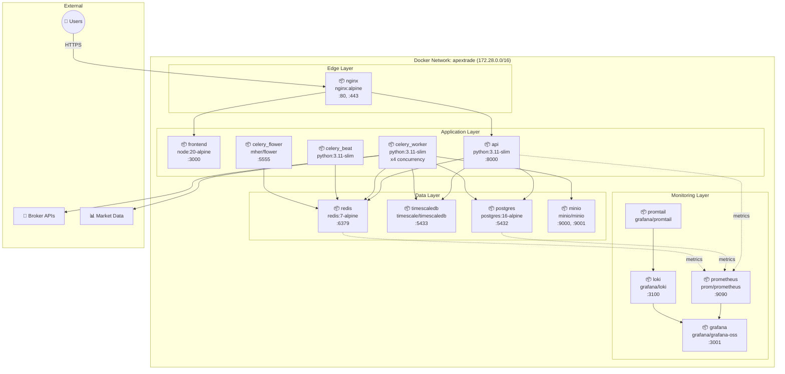
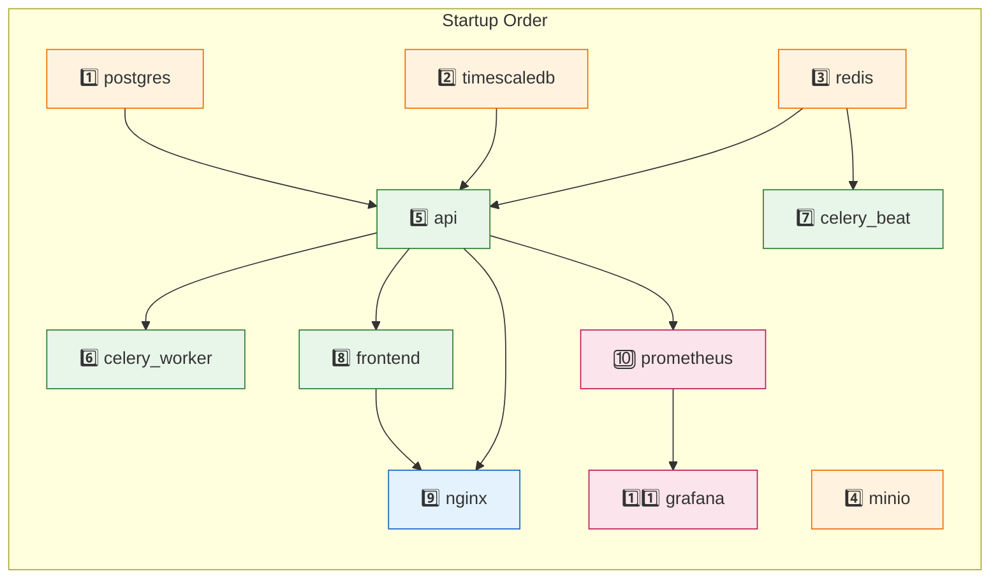
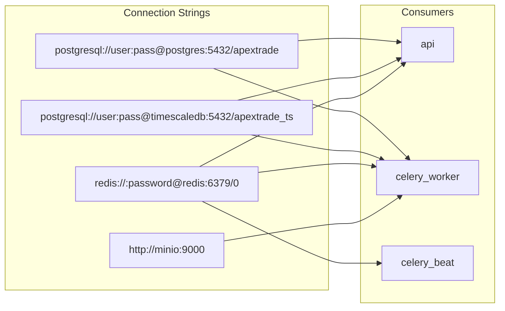
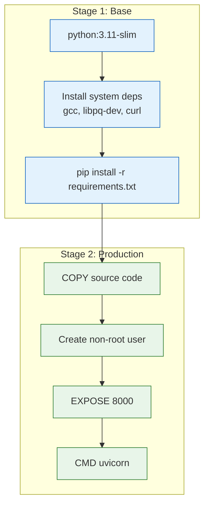
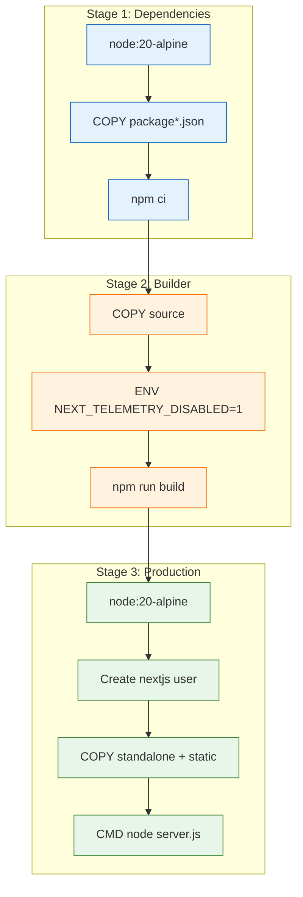
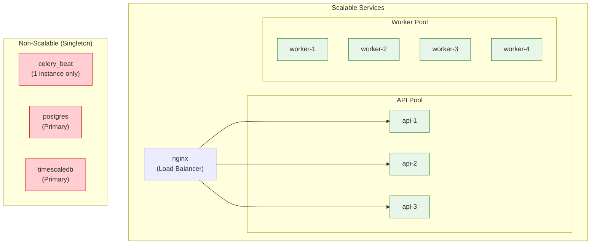
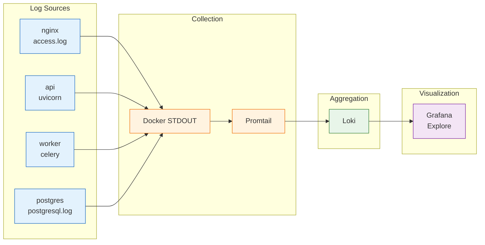

# ApexTrade - Container Topology

**Version:** 1.0  
**Date:** February 1, 2026

---

## 1. Container Overview



---

## 2. Container Specifications

### 2.1 Resource Allocation

| Container | CPU Limit | Memory Limit | Replicas | Restart Policy |
|-----------|-----------|--------------|----------|----------------|
| nginx | 0.5 | 256 MB | 1 | unless-stopped |
| frontend | 1 | 512 MB | 1 | unless-stopped |
| api | 2 | 2 GB | 1-3 | unless-stopped |
| celery_worker | 2 | 2 GB | 1-4 | unless-stopped |
| celery_beat | 0.25 | 256 MB | 1 | unless-stopped |
| celery_flower | 0.5 | 256 MB | 1 | unless-stopped |
| postgres | 2 | 2 GB | 1 | unless-stopped |
| timescaledb | 4 | 4 GB | 1 | unless-stopped |
| redis | 1 | 1 GB | 1 | unless-stopped |
| minio | 1 | 1 GB | 1 | unless-stopped |
| prometheus | 0.5 | 512 MB | 1 | unless-stopped |
| grafana | 0.5 | 512 MB | 1 | unless-stopped |
| loki | 0.5 | 512 MB | 1 | unless-stopped |
| promtail | 0.25 | 128 MB | 1 | unless-stopped |

### 2.2 Port Mapping

```
┌─────────────────────────────────────────────────────────────────────────────────┐
│                           PORT MAPPING                                           │
├─────────────────────────────────────────────────────────────────────────────────┤
│                                                                                  │
│   HOST                    CONTAINER              SERVICE                         │
│   ────                    ─────────              ───────                         │
│                                                                                  │
│   EXPOSED (Public):                                                              │
│   80    ──────────────►   80       ──────────►   nginx (HTTP)                   │
│   443   ──────────────►   443      ──────────►   nginx (HTTPS)                  │
│                                                                                  │
│   EXPOSED (Admin Only):                                                          │
│   3001  ──────────────►   3000     ──────────►   grafana (Dashboard)            │
│   5433  ──────────────►   5432     ──────────►   timescaledb (Dev access)       │
│                                                                                  │
│   INTERNAL ONLY (Docker Network):                                                │
│   -     ──────────────►   3000     ──────────►   frontend                       │
│   -     ──────────────►   8000     ──────────►   api                            │
│   -     ──────────────►   5432     ──────────►   postgres                       │
│   -     ──────────────►   6379     ──────────►   redis                          │
│   -     ──────────────►   9000     ──────────►   minio (S3)                     │
│   -     ──────────────►   9001     ──────────►   minio (Console)                │
│   -     ──────────────►   9090     ──────────►   prometheus                     │
│   -     ──────────────►   3100     ──────────►   loki                           │
│   -     ──────────────►   5555     ──────────►   flower                         │
│                                                                                  │
└──────────────────────────────────────────────────────────────────────────────────┘
```

---

## 3. Container Dependencies



### 3.1 Health Check Configuration

```yaml
# Health checks for each service

nginx:
  healthcheck:
    test: ["CMD", "nginx", "-t"]
    interval: 30s
    timeout: 10s
    retries: 3

frontend:
  healthcheck:
    test: ["CMD", "curl", "-f", "http://localhost:3000/api/health"]
    interval: 30s
    timeout: 10s
    retries: 3

api:
  healthcheck:
    test: ["CMD", "curl", "-f", "http://localhost:8000/health"]
    interval: 30s
    timeout: 10s
    retries: 3
    start_period: 40s

postgres:
  healthcheck:
    test: ["CMD-SHELL", "pg_isready -U $POSTGRES_USER -d $POSTGRES_DB"]
    interval: 10s
    timeout: 5s
    retries: 5

timescaledb:
  healthcheck:
    test: ["CMD-SHELL", "pg_isready -U $TIMESCALE_USER -d $TIMESCALE_DB"]
    interval: 10s
    timeout: 5s
    retries: 5

redis:
  healthcheck:
    test: ["CMD", "redis-cli", "-a", "$REDIS_PASSWORD", "ping"]
    interval: 10s
    timeout: 5s
    retries: 5

minio:
  healthcheck:
    test: ["CMD", "curl", "-f", "http://localhost:9000/minio/health/live"]
    interval: 30s
    timeout: 10s
    retries: 3
```

---

## 4. Volume Mapping

```mermaid
graph TB
    subgraph "Named Volumes"
        V1["postgres_data"]
        V2["timescale_data"]
        V3["redis_data"]
        V4["minio_data"]
        V5["prometheus_data"]
        V6["grafana_data"]
        V7["loki_data"]
    end

    subgraph "Bind Mounts (Config)"
        B1["./nginx/nginx.conf"]
        B2["./nginx/conf.d/"]
        B3["./monitoring/prometheus/"]
        B4["./monitoring/grafana/"]
        B5["./monitoring/loki/"]
        B6["./certbot/"]
    end

    subgraph "Containers"
        PG["postgres"]
        TS["timescaledb"]
        RD["redis"]
        MINIO["minio"]
        PROM["prometheus"]
        GRAF["grafana"]
        LOKI["loki"]
        NGINX["nginx"]
    end

    V1 --> PG
    V2 --> TS
    V3 --> RD
    V4 --> MINIO
    V5 --> PROM
    V6 --> GRAF
    V7 --> LOKI

    B1 --> NGINX
    B2 --> NGINX
    B3 --> PROM
    B4 --> GRAF
    B5 --> LOKI
    B6 --> NGINX

    classDef vol fill:#e8f5e9,stroke:#2e7d32
    classDef bind fill:#e3f2fd,stroke:#1565c0
    classDef cont fill:#fff3e0,stroke:#ef6c00

    class V1,V2,V3,V4,V5,V6,V7 vol
    class B1,B2,B3,B4,B5,B6 bind
    class PG,TS,RD,MINIO,PROM,GRAF,LOKI,NGINX cont
```



### 4.1 Volume Details

| Volume | Container Path | Purpose | Backup Priority |
|--------|----------------|---------|-----------------|
| postgres_data | /var/lib/postgresql/data | Main database | 🔴 Critical |
| timescale_data | /var/lib/postgresql/data | Time-series data | 🔴 Critical |
| redis_data | /data | Cache persistence | 🟡 Medium |
| minio_data | /data | Object storage | 🟡 Medium |
| prometheus_data | /prometheus | Metrics history | 🟢 Low |
| grafana_data | /var/lib/grafana | Dashboards | 🟢 Low |
| loki_data | /loki | Log storage | 🟢 Low |

---

## 5. Network Configuration

### 5.1 Docker Network Diagram

```
┌─────────────────────────────────────────────────────────────────────────────────┐
│                     Docker Network: apextrade                                    │
│                     Subnet: 172.28.0.0/16                                       │
│                     Driver: bridge                                               │
├─────────────────────────────────────────────────────────────────────────────────┤
│                                                                                  │
│   ┌─────────────────────────────────────────────────────────────────────────┐   │
│   │                        DNS Resolution (Docker DNS)                       │   │
│   │                                                                          │   │
│   │   nginx        → 172.28.0.2                                             │   │
│   │   frontend     → 172.28.0.3                                             │   │
│   │   api          → 172.28.0.4                                             │   │
│   │   postgres     → 172.28.0.5                                             │   │
│   │   timescaledb  → 172.28.0.6                                             │   │
│   │   redis        → 172.28.0.7                                             │   │
│   │   minio        → 172.28.0.8                                             │   │
│   │   celery_worker → 172.28.0.9                                            │   │
│   │   celery_beat   → 172.28.0.10                                           │   │
│   │   celery_flower → 172.28.0.11                                           │   │
│   │   prometheus    → 172.28.0.12                                           │   │
│   │   grafana       → 172.28.0.13                                           │   │
│   │   loki          → 172.28.0.14                                           │   │
│   │   promtail      → 172.28.0.15                                           │   │
│   │                                                                          │   │
│   └─────────────────────────────────────────────────────────────────────────┘   │
│                                                                                  │
│   Service Discovery via Container Names:                                         │
│   ─────────────────────────────────────                                         │
│   api → postgres:5432     (PostgreSQL connection)                               │
│   api → redis:6379        (Cache/Queue connection)                              │
│   api → timescaledb:5432  (TimescaleDB connection)                              │
│   nginx → frontend:3000   (Upstream proxy)                                       │
│   nginx → api:8000        (API proxy)                                           │
│                                                                                  │
└──────────────────────────────────────────────────────────────────────────────────┘
```

### 5.2 Internal Service Connections



---

## 6. Container Build Stages

### 6.1 API Container Build



### 6.2 Frontend Container Build



---

## 7. Scaling Configuration

### 7.1 Horizontal Scaling



### 7.2 Scaling Commands

```bash
# Scale API to 3 instances
docker compose up -d --scale api=3

# Scale workers to 4 instances
docker compose up -d --scale celery_worker=4

# Scale multiple services
docker compose up -d --scale api=3 --scale celery_worker=4
```

---

## 8. Container Logging

### 8.1 Log Flow



### 8.2 Log Labels

| Label | Values | Purpose |
|-------|--------|---------|
| container | nginx, api, worker, etc. | Filter by service |
| level | debug, info, warn, error | Filter by severity |
| job | apextrade | Namespace |

---

## 9. Security Hardening

### 9.1 Container Security

```yaml
# Security configurations applied to containers

# Non-root user
user: "1000:1000"

# Read-only filesystem (where possible)
read_only: true
tmpfs:
  - /tmp
  - /var/run

# Drop all capabilities, add only needed
cap_drop:
  - ALL
cap_add:
  - NET_BIND_SERVICE  # nginx only

# No privilege escalation
security_opt:
  - no-new-privileges:true

# Resource limits (DoS protection)
deploy:
  resources:
    limits:
      cpus: '2'
      memory: 2G
    reservations:
      cpus: '0.5'
      memory: 512M
```

### 9.2 Network Security

```
┌─────────────────────────────────────────────────────────────────────────────────┐
│                          NETWORK SECURITY ZONES                                  │
├─────────────────────────────────────────────────────────────────────────────────┤
│                                                                                  │
│   ┌───────────────────────────────────────────────────────────────────────────┐ │
│   │ ZONE: Public (Internet Facing)                                            │ │
│   │                                                                            │ │
│   │   nginx (:80, :443)                                                       │ │
│   │   └── TLS 1.2+, Rate Limiting, Security Headers                          │ │
│   │                                                                            │ │
│   └───────────────────────────────────────────────────────────────────────────┘ │
│                                       │                                          │
│                                       ▼                                          │
│   ┌───────────────────────────────────────────────────────────────────────────┐ │
│   │ ZONE: Application (Internal Only)                                         │ │
│   │                                                                            │ │
│   │   frontend, api, celery_worker, celery_beat, flower                       │ │
│   │   └── No public ports, accessed via nginx proxy                           │ │
│   │                                                                            │ │
│   └───────────────────────────────────────────────────────────────────────────┘ │
│                                       │                                          │
│                                       ▼                                          │
│   ┌───────────────────────────────────────────────────────────────────────────┐ │
│   │ ZONE: Data (Restricted)                                                   │ │
│   │                                                                            │ │
│   │   postgres, timescaledb, redis, minio                                     │ │
│   │   └── No public ports, password protected, connection pooling             │ │
│   │                                                                            │ │
│   └───────────────────────────────────────────────────────────────────────────┘ │
│                                       │                                          │
│                                       ▼                                          │
│   ┌───────────────────────────────────────────────────────────────────────────┐ │
│   │ ZONE: Monitoring (Admin Only)                                             │ │
│   │                                                                            │ │
│   │   prometheus, grafana, loki                                               │ │
│   │   └── Grafana: Admin-only access (:3001)                                  │ │
│   │                                                                            │ │
│   └───────────────────────────────────────────────────────────────────────────┘ │
│                                                                                  │
└──────────────────────────────────────────────────────────────────────────────────┘
```

---

## 10. Docker Compose Commands

```bash
# ═══════════════════════════════════════════════════════════
# LIFECYCLE COMMANDS
# ═══════════════════════════════════════════════════════════

# Start all services (detached)
docker compose up -d

# Stop all services
docker compose down

# Stop and remove volumes (CAUTION: Data loss!)
docker compose down -v

# Rebuild and restart
docker compose up -d --build

# Restart specific service
docker compose restart api

# ═══════════════════════════════════════════════════════════
# SCALING COMMANDS
# ═══════════════════════════════════════════════════════════

# Scale workers
docker compose up -d --scale celery_worker=4

# Scale API (requires nginx upstream update)
docker compose up -d --scale api=3

# ═══════════════════════════════════════════════════════════
# LOGGING COMMANDS
# ═══════════════════════════════════════════════════════════

# View all logs
docker compose logs -f

# View specific service logs
docker compose logs -f api

# View last 100 lines
docker compose logs --tail=100 api

# ═══════════════════════════════════════════════════════════
# DEBUGGING COMMANDS
# ═══════════════════════════════════════════════════════════

# Enter container shell
docker compose exec api /bin/bash
docker compose exec postgres psql -U apextrade -d apextrade

# View container stats
docker stats --no-stream

# View container processes
docker compose top

# ═══════════════════════════════════════════════════════════
# MAINTENANCE COMMANDS
# ═══════════════════════════════════════════════════════════

# Run database migrations
docker compose exec api alembic upgrade head

# Prune unused images
docker system prune -a

# View volume usage
docker system df -v
```

---

*Document End*
