# ApexTrade - Data Flow Diagrams

**Version:** 1.0  
**Date:** February 1, 2026

---

## 1. Overall Data Flow

```mermaid
flowchart TB
    subgraph "External Data Sources"
        MKT["📊 Market Data APIs<br/>yfinance · CCXT · Alpha Vantage"]
        BRK["🏦 Brokers<br/>Alpaca · Binance · Kraken"]
    end

    subgraph "Data Ingestion Layer"
        FETCH["Data Fetcher<br/>Celery Task"]
        NORM["Normalizer<br/>OHLCV Format"]
        VALID["Validator<br/>Data Quality"]
    end

    subgraph "Storage Layer"
        TS[("TimescaleDB<br/>OHLCV Hypertables")]
        PG[("PostgreSQL<br/>Trades · Strategies")]
        RD[("Redis<br/>Cache · Pubsub")]
        S3[("MinIO<br/>Backtest Reports")]
    end

    subgraph "Processing Layer"
        STRAT["Strategy Engine"]
        BACK["Backtest Engine"]
        EXEC["Trade Executor"]
    end

    subgraph "Presentation Layer"
        API["FastAPI"]
        WS["WebSocket"]
        FE["Next.js Frontend"]
    end

    subgraph "User"
        USER((👤 User))
    end

    %% Ingestion Flow
    MKT -->|HTTP/WS| FETCH
    FETCH --> NORM
    NORM --> VALID
    VALID -->|time-series| TS
    VALID -->|cache| RD

    %% Processing Flow
    TS --> STRAT
    TS --> BACK
    STRAT -->|signals| EXEC
    EXEC -->|orders| BRK
    BRK -->|fills| EXEC
    EXEC -->|trades| PG
    BACK -->|results| PG
    BACK -->|reports| S3

    %% Presentation Flow
    PG --> API
    TS --> API
    RD --> API
    API --> WS
    API --> FE
    WS --> FE
    FE --> USER

    %% Real-time Updates
    EXEC -.->|events| RD
    RD -.->|pubsub| WS

    classDef external fill:#e3f2fd,stroke:#1565c0
    classDef ingest fill:#fff3e0,stroke:#ef6c00
    classDef storage fill:#e8f5e9,stroke:#2e7d32
    classDef process fill:#fce4ec,stroke:#c2185b
    classDef present fill:#f3e5f5,stroke:#7b1fa2

    class MKT,BRK external
    class FETCH,NORM,VALID ingest
    class TS,PG,RD,S3 storage
    class STRAT,BACK,EXEC process
    class API,WS,FE present
```

---

## 2. Market Data Ingestion Flow

```mermaid
sequenceDiagram
    participant SCHED as Celery Beat
    participant WORKER as Celery Worker
    participant CCXT as CCXT/yfinance
    participant NORM as Normalizer
    participant VALID as Validator
    participant TS as TimescaleDB
    participant RD as Redis
    participant WS as WebSocket

    Note over SCHED,WS: Scheduled Data Fetch (Every 1 minute)
    
    SCHED->>WORKER: trigger fetch_ohlcv_task
    WORKER->>CCXT: fetch_ohlcv("BTC/EUR", "1m")
    CCXT-->>WORKER: Raw OHLCV array
    
    WORKER->>NORM: normalize(data, "binance")
    Note over NORM: Convert to standard format<br/>Timezone: UTC<br/>Volume: Base currency
    NORM-->>WORKER: Normalized OHLCV
    
    WORKER->>VALID: validate(data)
    Note over VALID: Check:<br/>• No future timestamps<br/>• High >= Low<br/>• Volume >= 0
    
    alt Validation Passed
        VALID-->>WORKER: Valid data
        WORKER->>TS: INSERT INTO ohlcv
        TS-->>WORKER: Inserted
        WORKER->>RD: SET cache:ticker:BTC/EUR
        WORKER->>RD: PUBLISH price:BTC/EUR
        RD->>WS: Notify subscribers
    else Validation Failed
        VALID-->>WORKER: Validation errors
        WORKER->>RD: Log error
        Note over WORKER: Skip invalid candle
    end
```

---

## 3. Strategy Execution Flow

```mermaid
flowchart TB
    subgraph "Trigger"
        CRON["⏰ Cron Schedule<br/>Every 1 min"]
        PRICE["📈 Price Event<br/>New candle"]
    end

    subgraph "Strategy Evaluation"
        LOAD["Load Active<br/>Strategies"]
        FETCH["Fetch OHLCV<br/>Data"]
        CALC["Calculate<br/>Indicators"]
        EVAL["Evaluate<br/>Conditions"]
    end

    subgraph "Signal Decision"
        CHECK{{"Check<br/>All Rules"}}
        ENTRY["Entry<br/>Signal"]
        EXIT["Exit<br/>Signal"]
        HOLD["Hold<br/>No Action"]
    end

    subgraph "Trade Execution"
        SIZE["Position<br/>Sizing"]
        RISK["Risk<br/>Check"]
        ORDER["Create<br/>Order"]
        SUBMIT["Submit to<br/>Broker"]
    end

    subgraph "Post-Trade"
        FILL["Process<br/>Fill"]
        POS["Update<br/>Position"]
        LOG["Log<br/>Trade"]
        NOTIFY["Send<br/>Notification"]
    end

    CRON --> LOAD
    PRICE --> LOAD
    LOAD --> FETCH
    FETCH --> CALC
    CALC --> EVAL
    EVAL --> CHECK

    CHECK -->|Entry conditions met| ENTRY
    CHECK -->|Exit conditions met| EXIT
    CHECK -->|No conditions met| HOLD

    ENTRY --> SIZE
    EXIT --> SIZE
    SIZE --> RISK
    RISK -->|Approved| ORDER
    RISK -->|Rejected| HOLD
    ORDER --> SUBMIT
    SUBMIT --> FILL
    FILL --> POS
    POS --> LOG
    LOG --> NOTIFY

    HOLD --> END((End))
    NOTIFY --> END

    classDef trigger fill:#e1f5fe,stroke:#0277bd
    classDef eval fill:#fff8e1,stroke:#ff8f00
    classDef decision fill:#f3e5f5,stroke:#8e24aa
    classDef exec fill:#e8f5e9,stroke:#388e3c
    classDef post fill:#fce4ec,stroke:#d81b60

    class CRON,PRICE trigger
    class LOAD,FETCH,CALC,EVAL eval
    class CHECK,ENTRY,EXIT,HOLD decision
    class SIZE,RISK,ORDER,SUBMIT exec
    class FILL,POS,LOG,NOTIFY post
```

---

## 4. Backtest Data Flow

```mermaid
flowchart LR
    subgraph "Input"
        USER((User))
        STRAT["Strategy<br/>Definition"]
        PARAMS["Parameters<br/>Dates · Capital"]
    end

    subgraph "Data Preparation"
        LOAD["Load Historical<br/>OHLCV"]
        SLICE["Slice Date<br/>Range"]
        PREP["Prepare<br/>DataFrames"]
    end

    subgraph "Simulation Engine"
        ITER["Iterate<br/>Candles"]
        IND["Calculate<br/>Indicators"]
        SIG["Generate<br/>Signals"]
        TRADE["Simulate<br/>Trades"]
        PORT["Update<br/>Portfolio"]
    end

    subgraph "Metrics Calculation"
        RET["Returns"]
        DD["Drawdown"]
        SHARPE["Sharpe Ratio"]
        WIN["Win Rate"]
    end

    subgraph "Output"
        RESULTS["Results<br/>JSON"]
        EQUITY["Equity<br/>Curve"]
        TRADES["Trade<br/>List"]
        REPORT["PDF<br/>Report"]
    end

    USER -->|Configure| STRAT
    USER -->|Configure| PARAMS
    STRAT --> LOAD
    PARAMS --> LOAD
    LOAD --> SLICE
    SLICE --> PREP
    PREP --> ITER

    ITER --> IND
    IND --> SIG
    SIG --> TRADE
    TRADE --> PORT
    PORT -->|Next candle| ITER

    PORT --> RET
    PORT --> DD
    RET --> SHARPE
    PORT --> WIN

    RET --> RESULTS
    DD --> RESULTS
    SHARPE --> RESULTS
    WIN --> RESULTS

    RESULTS --> EQUITY
    RESULTS --> TRADES
    RESULTS --> REPORT

    classDef input fill:#e3f2fd,stroke:#1565c0
    classDef prep fill:#fff3e0,stroke:#ef6c00
    classDef sim fill:#e8f5e9,stroke:#2e7d32
    classDef calc fill:#f3e5f5,stroke:#7b1fa2
    classDef output fill:#fce4ec,stroke:#c2185b

    class USER,STRAT,PARAMS input
    class LOAD,SLICE,PREP prep
    class ITER,IND,SIG,TRADE,PORT sim
    class RET,DD,SHARPE,WIN calc
    class RESULTS,EQUITY,TRADES,REPORT output
```

---

## 5. Authentication Flow

---

## 6. Real-Time Data Flow (WebSocket)

---

## 7. Error Handling & Recovery Flow

---

## 8. Data Lifecycle

---

## 9. Cache Invalidation Strategy

---

*Document End*
