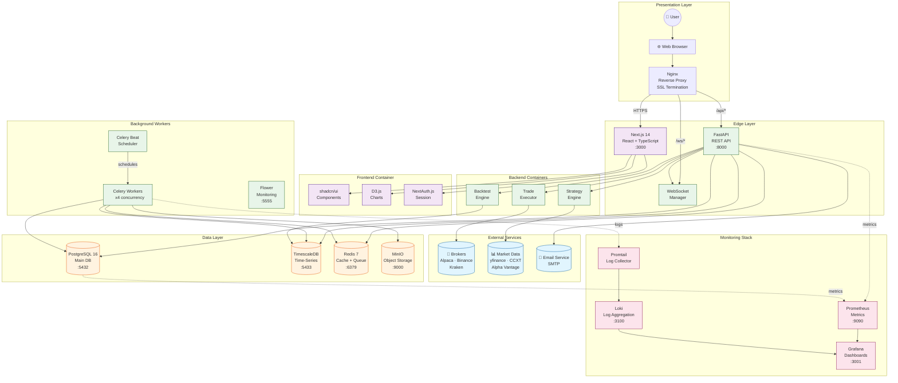
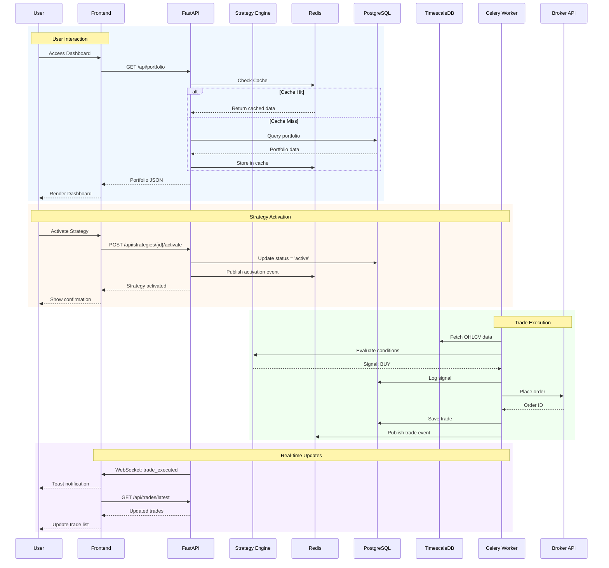
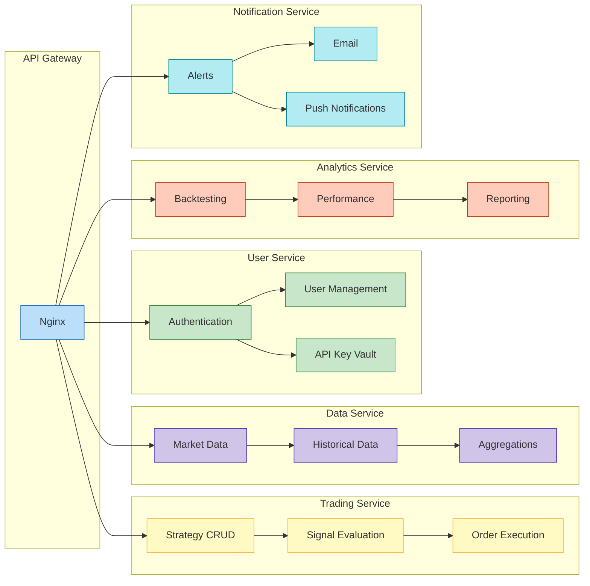

# ApexTrade - System Architecture Diagram

**Version:** 1.0  
**Date:** February 1, 2026

---

## High-Level System Architecture



---

## Component Interaction Diagram



---

## Microservice Boundaries



---

## Technology Stack Matrix

```
┌─────────────────────────────────────────────────────────────────────────────────┐
│                           APEXTRADE TECH STACK                                   │
├───────────────┬─────────────────────────────────────────────────────────────────┤
│               │                                                                  │
│  PRESENTATION │  Next.js 14 │ React 18 │ TypeScript │ Tailwind CSS │ D3.js     │
│     LAYER     │  shadcn/ui │ NextAuth.js │ SWR │ Zustand                        │
│               │                                                                  │
├───────────────┼─────────────────────────────────────────────────────────────────┤
│               │                                                                  │
│  APPLICATION  │  FastAPI │ Pydantic │ SQLAlchemy 2.0 │ Celery │ Redis          │
│     LAYER     │  WebSocket │ JWT Auth │ CORS │ Rate Limiting                   │
│               │                                                                  │
├───────────────┼─────────────────────────────────────────────────────────────────┤
│               │                                                                  │
│   BUSINESS    │  Strategy Engine │ Rule Parser │ Signal Generator              │
│    LOGIC      │  Backtest Engine │ Trade Executor │ Portfolio Manager          │
│               │                                                                  │
├───────────────┼─────────────────────────────────────────────────────────────────┤
│               │                                                                  │
│  DATA ACCESS  │  PostgreSQL 16 │ TimescaleDB │ Redis │ MinIO                   │
│     LAYER     │  Alembic Migrations │ Connection Pooling │ Caching             │
│               │                                                                  │
├───────────────┼─────────────────────────────────────────────────────────────────┤
│               │                                                                  │
│ INFRASTRUCTURE│  Docker │ Docker Compose │ Nginx │ Let's Encrypt               │
│     LAYER     │  Prometheus │ Grafana │ Loki │ Promtail                        │
│               │                                                                  │
├───────────────┼─────────────────────────────────────────────────────────────────┤
│               │                                                                  │
│   EXTERNAL    │  Alpaca API │ Binance/CCXT │ yfinance │ Alpha Vantage          │
│ INTEGRATIONS  │  SMTP │ WebSocket Feeds                                         │
│               │                                                                  │
└───────────────┴─────────────────────────────────────────────────────────────────┘
```

---

## Security Architecture

```mermaid
graph TB
    subgraph "Internet"
        USER((User))
        ATTACKER((Attacker))
    end

    subgraph "Edge Security"
        FW["Firewall<br/>UFW/iptables"]
        RATE["Rate Limiting<br/>30 req/s"]
        WAF["Nginx<br/>Security Headers"]
        SSL["TLS 1.3<br/>HTTPS Only"]
    end

    subgraph "Application Security"
        AUTH["JWT Authentication<br/>15min expiry"]
        RBAC["Role-Based Access<br/>User/Admin"]
        VALID["Input Validation<br/>Pydantic"]
        CORS["CORS<br/>Whitelist"]
    end

    subgraph "Data Security"
        ENCRYPT["AES-256-GCM<br/>API Key Encryption"]
        HASH["Argon2id<br/>Password Hashing"]
        SSL_DB["SSL/TLS<br/>DB Connections"]
    end

    subgraph "Audit & Compliance"
        LOGS["Audit Logs<br/>7 years retention"]
        GDPR["GDPR Compliance<br/>Data Export/Delete"]
        MIFID["MiFID II Ready<br/>Trade Records"]
    end

    USER --> FW
    ATTACKER -.->|blocked| FW
    FW --> RATE
    RATE --> WAF
    WAF --> SSL
    SSL --> AUTH
    AUTH --> RBAC
    RBAC --> VALID
    VALID --> CORS
    CORS --> ENCRYPT
    ENCRYPT --> HASH
    HASH --> SSL_DB
    SSL_DB --> LOGS
    LOGS --> GDPR
    GDPR --> MIFID

    classDef blocked fill:#ffcdd2,stroke:#c62828
    classDef security fill:#c8e6c9,stroke:#2e7d32
    classDef data fill:#fff9c4,stroke:#f9a825
    classDef audit fill:#e1f5fe,stroke:#0277bd

    class ATTACKER blocked
    class FW,RATE,WAF,SSL,AUTH,RBAC,VALID,CORS security
    class ENCRYPT,HASH,SSL_DB data
    class LOGS,GDPR,MIFID audit
```



---

## Scalability Patterns

```mermaid
graph TB
    subgraph "Horizontal Scaling"
        LB["Load Balancer"]
        API1["API Instance 1"]
        API2["API Instance 2"]
        API3["API Instance N"]
        
        LB --> API1
        LB --> API2
        LB --> API3
    end

    subgraph "Worker Scaling"
        QUEUE["Redis Queue"]
        W1["Worker 1"]
        W2["Worker 2"]
        W3["Worker N"]
        
        QUEUE --> W1
        QUEUE --> W2
        QUEUE --> W3
    end

    subgraph "Database Scaling"
        PG_PRIMARY["PostgreSQL<br/>Primary"]
        PG_REPLICA["PostgreSQL<br/>Read Replica"]
        TS_HT["TimescaleDB<br/>Hypertables"]
        COMPRESS["Compression<br/>+ Retention"]
        
        PG_PRIMARY --> PG_REPLICA
        TS_HT --> COMPRESS
    end

    subgraph "Caching Layers"
        L1["L1: Application Cache<br/>(in-memory)"]
        L2["L2: Redis Cache<br/>(distributed)"]
        L3["L3: CDN Cache<br/>(static assets)"]
    end

    API1 --> L1
    L1 --> L2
    L2 --> PG_PRIMARY
    L2 --> PG_REPLICA
```



---

*Document End*
